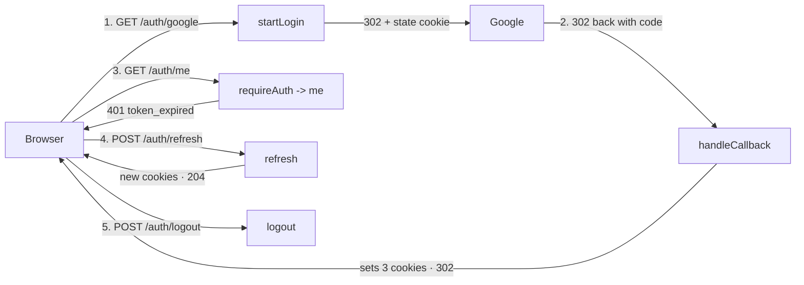
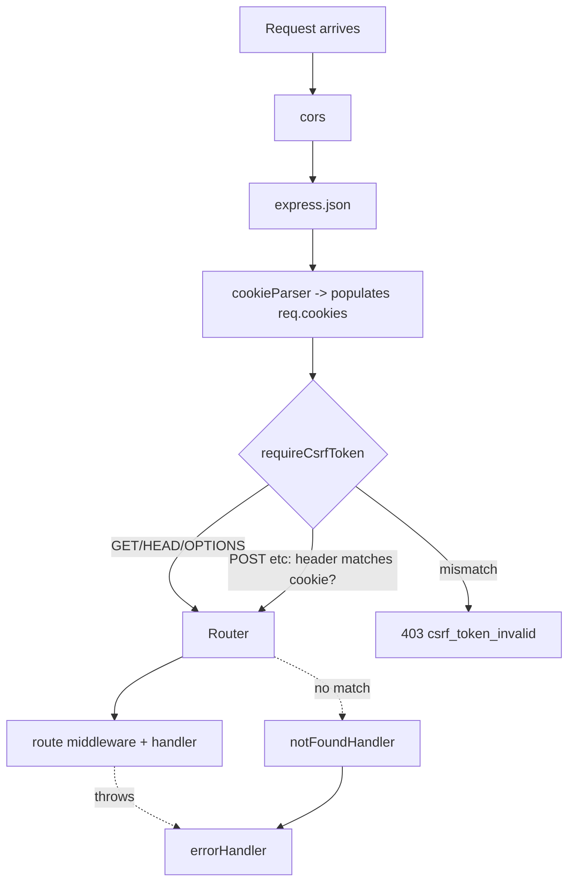
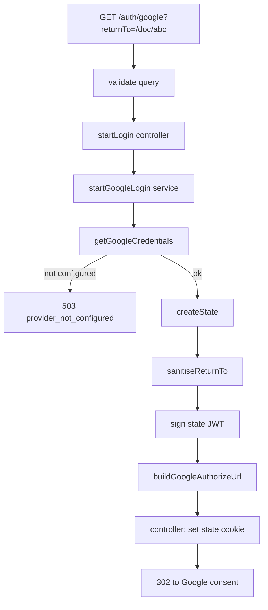
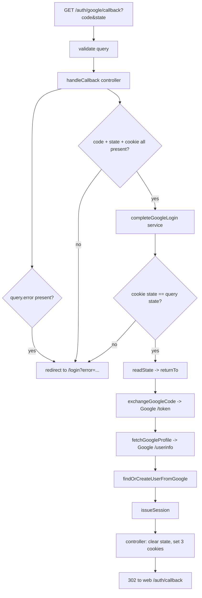
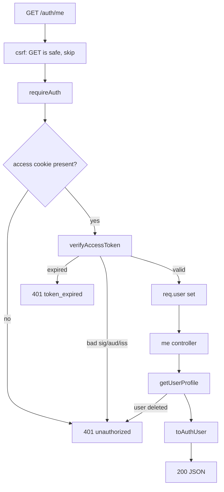
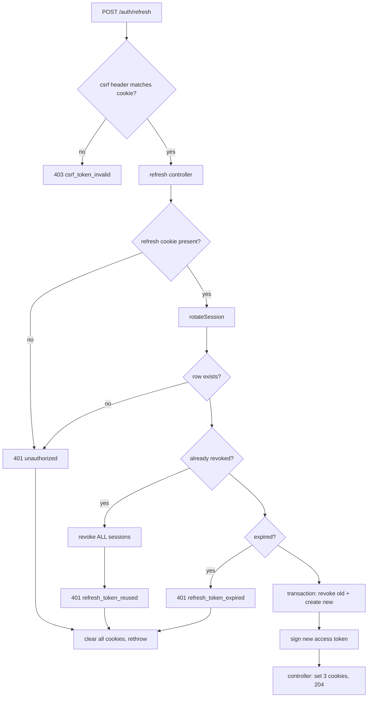
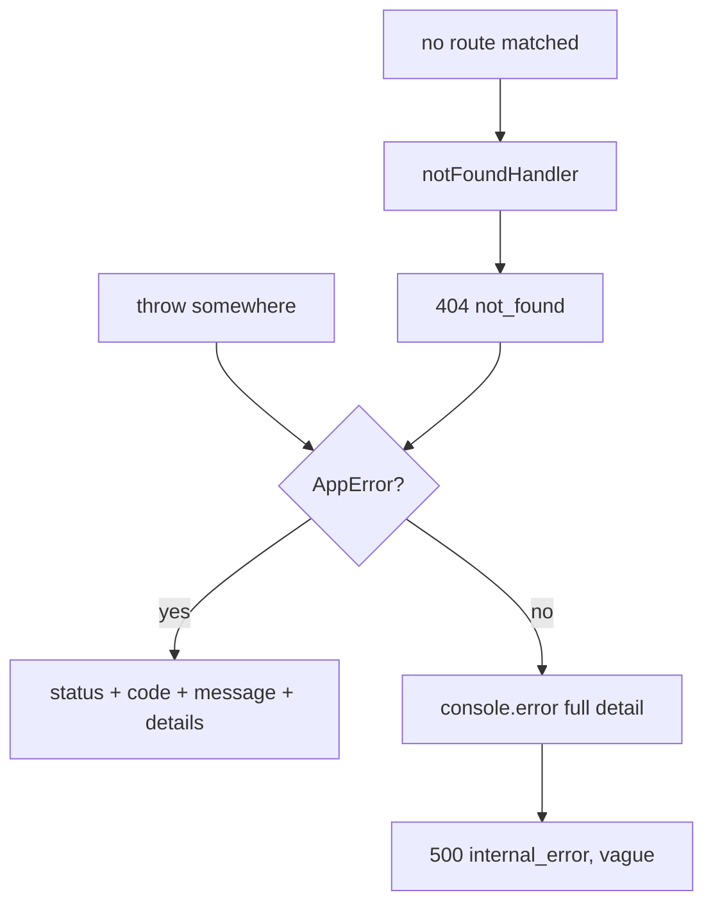

# DocSync — Authentication Code Walkthrough

**Status:** Reference
**Scope:** `apps/server` — the backend auth system, Google OAuth only
**Last updated:** September 2026

This document follows the **code**, one flow at a time, in the order it actually executes. For each flow: what triggers it, the chain of calls it makes, then every hop with the real source and why that line is there.

> **How to read this.** Sections are numbered `Flow N` and hops within them `Hop N.M`, so the appendices and cross-references can point at an exact step. Every code block is quoted verbatim from the file linked above it. Architecture and roadmap context lives in [`techspec.md`](./techspec.md) (auth is §10, roles are §8).

---

## The six flows

| # | Flow | Entry point | Auth needed |
|---|---|---|---|
| 0 | **Boot** | `src/index.ts` | — |
| 1 | **Every request** (middleware chain) | `src/index.ts` | — |
| 2 | **Start login** | `GET /auth/google` | none |
| 3 | **Finish login** | `GET /auth/google/callback` | none |
| 4 | **Authenticated request** | `GET /auth/me` | access cookie |
| 5 | **Refresh** | `POST /auth/refresh` | refresh cookie + CSRF |
| 6 | **Logout** | `POST /auth/logout` | refresh cookie + CSRF |

Plus **Flow 7**, which isn't a route: how an error thrown anywhere becomes a JSON response.

### The one-picture version



---

## Flow 0 — Boot

**Trigger:** `pnpm dev` → `tsx src/index.ts`

Nothing here handles a request, but it decides what *can* happen, and it can kill the process before the server ever listens.

### Hop 0.1 — Env is parsed at import time

`src/index.ts` line 4 imports `env`, which runs [`config/env.ts`](../apps/server/src/config/env.ts) top to bottom immediately:

```ts
import "dotenv/config";
import { z } from "zod";

const envSchema = z.object({
  NODE_ENV: z.enum(["development", "test", "production"]).default("development"),
  PORT: z.coerce.number().int().positive().default(3000),
  DATABASE_URL: z.string().min(1, "DATABASE_URL is required"),
  SERVER_ORIGIN: z.string().url().default("http://localhost:3000"),
  WEB_ORIGIN: z.string().url().default("http://localhost:4000"),
  JWT_SECRET: z.string().min(32, "JWT_SECRET must be at least 32 characters"),
  GOOGLE_CLIENT_ID: z.string().optional(),
  GOOGLE_CLIENT_SECRET: z.string().optional(),
});

const parsed = envSchema.safeParse(process.env);

if (!parsed.success) {
  const issues = parsed.error.issues
    .map((issue) => `  - ${issue.path.join(".") || "(root)"}: ${issue.message}`)
    .join("\n");
  throw new Error(`Invalid environment configuration:\n${issues}`);
}

export const env = parsed.data;
```

The `throw` is at **module scope**, not inside a function. That's the point: a missing `JWT_SECRET` crashes the process on startup with a readable list, rather than surfacing as a 500 on the first user's login attempt days later.

Downstream consequence worth knowing: `env.JWT_SECRET` is typed `string`, not `string | undefined`, so `lib/jwt.ts` and `oauth/state.ts` can build their signing keys without a null check.

Note `GOOGLE_CLIENT_ID`/`SECRET` are **optional** — the server must boot with no OAuth client registered so you can develop before setting one up. The consequence shows up in Flow 2, Hop 2.4.

```ts
export const ACCESS_TOKEN_TTL_SECONDS = 15 * 60;        // 15 minutes
export const REFRESH_TOKEN_TTL_SECONDS = 30 * 24 * 60 * 60; // 30 days
export const OAUTH_STATE_TTL_SECONDS = 10 * 60;         // 10 minutes
```

Written as arithmetic so they read as what they are. All three are used later: access TTL in the JWT's `exp`, refresh TTL in the DB row *and* every cookie's `maxAge`, state TTL in the state token.

### Hop 0.2 — Prisma connects lazily

[`db/client.ts`](../apps/server/src/db/client.ts):

```ts
const adapter = new PrismaPg({ connectionString: process.env.DATABASE_URL });
export const prisma = new PrismaClient({ adapter });
```

Constructing the client does not open a connection; the first query does. Note this reads `process.env.DATABASE_URL` directly rather than the validated `env` — a small inconsistency, harmless because `env.ts` has already asserted it is non-empty by the time anything queries.

### Hop 0.3 — The app is assembled

[`index.ts`](../apps/server/src/index.ts) in full:

```ts
const app = express();

app.use(cors({ origin: env.WEB_ORIGIN, credentials: true }));
app.use(express.json({ limit: "1mb" }));
app.use(cookieParser());

app.use(requireCsrfToken);

app.get("/health", async (_req, res) => {
  const userCount = await prisma.user.count();
  res.json({ status: "ok", userCount });
});

app.use("/auth", authRouter);

app.use(notFoundHandler);
app.use(errorHandler);

app.listen(env.PORT, () => {
  console.log(`server listening on port ${env.PORT}`);
});
```

**The order of these `app.use` calls is the whole design.** Express runs them in registration order, so this file *is* the pipeline. Flow 1 walks it.

---

## Flow 1 — Every request: the middleware chain

Every one of the five auth routes passes through these four layers before its handler runs.



### Hop 1.1 — `cors`

```ts
app.use(cors({ origin: env.WEB_ORIGIN, credentials: true }));
```

The web app (`:4000`) and API (`:3000`) are separate origins, so the browser blocks cross-origin reads unless the server opts in.

`credentials: true` is **required for cookies to work at all cross-origin**. And `origin` must be a specific value — a browser refuses to send credentials to a wildcard `*`, so using one here would silently break every authenticated request.

A subtlety worth internalising: with a static `origin`, this middleware always echoes back that one configured value regardless of what the caller claims in its `Origin` header. It is the *browser* that then compares that value to its own origin and blocks the response on mismatch. `curl` performs no such check — so a `curl` request with a forged `Origin` still gets a response, and that is not a hole.

### Hop 1.2 — `express.json({ limit: "1mb" })`

None of the auth routes currently read a JSON body — the two POSTs work entirely off cookies. It is registered for the routes Round 2 adds, and the `1mb` cap stops an oversized body from consuming memory.

### Hop 1.3 — `cookieParser()`

This populates `req.cookies`. **Every credential in this system is a cookie**, so without this line nothing is ever authenticated and every request looks anonymous. It must run *before* `requireCsrfToken`, which reads `req.cookies`.

### Hop 1.4 — `requireCsrfToken`

[`middleware/csrf.ts`](../apps/server/src/middleware/csrf.ts):

```ts
const SAFE_METHODS = new Set(["GET", "HEAD", "OPTIONS"]);

export function requireCsrfToken(req: Request, _res: Response, next: NextFunction): void {
  if (SAFE_METHODS.has(req.method)) {
    next();
    return;
  }

  const cookieToken = req.cookies?.[CSRF_COOKIE] as string | undefined;
  const headerToken = req.get(CSRF_HEADER);

  if (!cookieToken || !headerToken || !constantTimeEquals(cookieToken, headerToken)) {
    next(new AppError(403, "csrf_token_invalid", "Missing or invalid CSRF token. Reload the page and try again."));
    return;
  }

  next();
}
```

**Why this exists:** credentials are cookies, and browsers attach cookies to *any* request to this origin — including one triggered by another site. That is CSRF. A bearer header was immune by construction (browsers never attach custom headers on their own); cookies are not, so the protection has to be added back explicitly.

Hop by hop:

- **Safe methods skip entirely.** `GET`/`HEAD`/`OPTIONS` are defined as not changing state, so forging one achieves nothing. Checking them would also break plain navigation, since a link click cannot carry a custom header — which matters directly, because Flows 2, 3 and 4 are all `GET`.
- **Both halves required.** A missing cookie *or* a missing header fails. "Skip when absent" would be bypassed by simply omitting the header.
- **`constantTimeEquals`, not `===`** — see Hop 5.2 for the timing-leak reasoning.
- **403, not 401.** The caller may be perfectly authenticated; what we cannot confirm is that *our page* initiated the request. That is a permission failure, not an identity one.

It is mounted **globally, before the router** — fail-closed, so a state-changing route added in Round 2 is protected by default rather than relying on someone remembering a middleware.

> **Phase 2 note:** a service worker cannot read `document.cookie`, so a Background Sync replay cannot fetch the CSRF value at send time. The fix is to capture the header into IndexedDB *when the request is queued* and replay it with the stored value.

### Hop 1.5 — The router

```ts
app.use("/auth", authRouter);
```

[`routes/auth.ts`](../apps/server/src/routes/auth.ts) is the complete auth surface:

```ts
authRouter.post("/refresh", authController.refresh);
authRouter.post("/logout", authController.logout);
authRouter.get("/me", requireAuth, authController.me);

authRouter.get("/google", validate("query", startQuerySchema), authController.startLogin);

authRouter.get(
  "/google/callback",
  validate("query", callbackQuerySchema),
  authController.handleCallback,
);
```

Every path is **literal — no dynamic segment**. That is load-bearing history: an earlier `/:provider` route silently shadowed `/auth/me`, matching `"me"` as a provider name, because Express tests routes in registration order and stops at the first match. `GET /auth/me` returned `400 Unsupported sign-in provider`. Collapsing to a single provider removed the parameter, so that class of bug is now structurally impossible rather than merely avoided by careful ordering.

Read any line left to right and you get its pipeline: *path → validate the shape → prove identity → handler.* CSRF is absent because it is already global.

---

## Flow 2 — Start login: `GET /auth/google`

**Trigger:** the user clicks "Continue with Google". The browser navigates to `GET /auth/google?returnTo=/doc/abc`, where `returnTo` is wherever they were headed before being interrupted to log in.



### Hop 2.1 — `validate("query", startQuerySchema)`

[`validators/auth.ts`](../apps/server/src/validators/auth.ts):

```ts
export const startQuerySchema = z.object({
  returnTo: z.string().optional(),
});
```

[`middleware/validate.ts`](../apps/server/src/middleware/validate.ts):

```ts
export function validate(part: RequestPart, schema: ZodType) {
  return (req: Request, _res: Response, next: NextFunction): void => {
    try {
      const parsed = schema.parse(req[part]);
      Object.defineProperty(req, part, { value: parsed, writable: true, configurable: true });
      next();
    } catch (error) {
      if (error instanceof ZodError) {
        next(AppError.badRequest(`Invalid request ${part}`, error.issues.map((issue) => ({
          path: issue.path.join("."),
          message: issue.message,
        }))));
        return;
      }
      next(error);
    }
  };
}
```

A function returning a function — that is how you make a configurable middleware.

The parsed result **replaces** `req.query`, so the handler receives stripped, typed data with unknown fields dropped. `Object.defineProperty` rather than `req.query = parsed` because **in Express 5 `req.query` is a getter and plain assignment throws** — a real bug this codebase hit.

### Hop 2.2 — `startLogin` controller

[`controllers/auth.ts`](../apps/server/src/controllers/auth.ts):

```ts
export async function startLogin(req: Request, res: Response): Promise<void> {
  const { returnTo } = req.query as unknown as StartQuery;

  const { state, authorizeUrl } = await startGoogleLogin(returnTo);

  setOAuthStateCookie(res, state);
  res.redirect(authorizeUrl);
}
```

Four lines, **no logic**: pull one value, call the service, set a cookie, redirect. The `as unknown as` cast is because Hop 2.1 already parsed the query, but Express's own types still describe it as raw strings.

### Hop 2.3 — `startGoogleLogin` service

[`services/oauth/login.ts`](../apps/server/src/services/oauth/login.ts):

```ts
export async function startGoogleLogin(
  returnTo: string | undefined,
): Promise<StartedGoogleLogin> {
  getGoogleCredentials();

  const state = await createState(returnTo);
  return { state, authorizeUrl: buildGoogleAuthorizeUrl(state) };
}
```

This service knows nothing about HTTP — no `req`, no `res`, no cookies. It takes a string and returns two strings; the controller decides what to do with them. That is what makes it callable from a script or a test with no Express in sight.

Note the credential check happens **first**, before `createState`. Ordering matters: fail early rather than after we have already set a state cookie the user could never use.

`returnTo` is passed through raw — `createState` sanitises it (Hop 2.5). It used to be sanitised here *as well*; one of the two calls was pure redundancy.

### Hop 2.4 — `getGoogleCredentials`

[`services/oauth/google.ts`](../apps/server/src/services/oauth/google.ts):

```ts
export function getGoogleCredentials(): GoogleCredentials {
  if (!env.GOOGLE_CLIENT_ID || !env.GOOGLE_CLIENT_SECRET) {
    throw new AppError(503, "provider_not_configured", "Google sign-in is not configured on this server");
  }
  return { clientId: env.GOOGLE_CLIENT_ID, clientSecret: env.GOOGLE_CLIENT_SECRET };
}
```

This is the **one gate** where "possibly missing" (Hop 0.1 made them optional) becomes "definitely present". After it, TypeScript knows both are `string`, so nothing downstream null-checks them.

**503, not 500:** the server is perfectly healthy, this capability just is not set up. A 500 would send you hunting for a crash that never happened.

### Hop 2.5 — `createState` and `sanitiseReturnTo`

[`services/oauth/state.ts`](../apps/server/src/services/oauth/state.ts):

```ts
export function sanitiseReturnTo(value: unknown): string {
  if (typeof value !== "string" || !value.startsWith("/") || value.startsWith("//")) {
    return "/";
  }
  return value;
}
```

Three conditions, each earning its place:

- **not a string** — someone sent `?returnTo=a&returnTo=b`, which arrives as an array.
- **does not start with `/`** — an absolute URL like `https://evil.com`.
- **starts with `//`** — the sneaky one. `//evil.com` *looks* like a path but browsers read it as a full URL, so without this line the callback becomes an open redirect that delivers a freshly minted session straight to an attacker's page.

Anything suspicious silently becomes `/`. We do not error — a bad `returnTo` should not block a legitimate login.

```ts
export async function createState(returnTo: string | undefined): Promise<string> {
  return new SignJWT({
    nonce: randomBytes(16).toString("base64url"),
    returnTo: sanitiseReturnTo(returnTo),
  })
    .setProtectedHeader({ alg: "HS256" })
    .setAudience(STATE_AUDIENCE)
    .setIssuedAt()
    .setExpirationTime(`${OAUTH_STATE_TTL_SECONDS}s`)
    .sign(secret);
}
```

- **`randomBytes(16)`, not `Math.random()`** — the latter is predictable, which would make the whole CSRF defence decorative.
- **The nonce is what makes each state unique.** HS256 is deterministic: without it, two logins started in the same second with the same `returnTo` would sign to *byte-identical* tokens, and one browser's state would satisfy the other's callback.
- **`STATE_AUDIENCE` is `"docsync-oauth-state"`** while access tokens use `"docsync-api"`. Both are signed with the same `JWT_SECRET`, so this tag is the only thing stopping a state token from being presented as an access token. Verified: doing so returns 401.
- **Signed rather than stored in a table** — self-verifying, so no state table, no cleanup job, no lookup, and it works across multiple server instances.

### Hop 2.6 — `buildGoogleAuthorizeUrl`

```ts
export function buildGoogleAuthorizeUrl(state: string): string {
  const { clientId } = getGoogleCredentials();

  const url = new URL(AUTHORIZE_URL);
  url.searchParams.set("client_id", clientId);
  url.searchParams.set("redirect_uri", googleRedirectUri());
  url.searchParams.set("response_type", "code");
  url.searchParams.set("scope", SCOPE);
  url.searchParams.set("state", state);
  url.searchParams.set("prompt", "select_account");
  return url.toString();
}
```

`URL` + `searchParams.set` handles escaping — building this by string concatenation is how you get broken URLs when a value contains `&` or `/`.

`SCOPE` is `"openid email profile"` — an identity plus a display name and picture, and nothing more. Every extra scope is one more thing the consent screen makes the user agree to.

`prompt=select_account` lets someone with several Google accounts pick. We deliberately do **not** request offline access: that exists to obtain a Google *refresh* token, and we never call Google again after login — we mint our own.

```ts
export function googleRedirectUri(): string {
  return `${env.SERVER_ORIGIN}/auth/google/callback`;
}
```

Derived from config, never hardcoded, and used in **two** places — here and in the token exchange (Hop 3.6). **It must match the Authorized redirect URI in the Google Cloud console byte-for-byte**; a trailing-slash mismatch is the single most common OAuth setup error, and Google's message for it is unhelpful.

### Hop 2.7 — The state cookie is set

[`lib/cookies.ts`](../apps/server/src/lib/cookies.ts):

```ts
function baseCookieOptions(): CookieOptions {
  return {
    httpOnly: true,
    secure: isProduction,
    sameSite: "lax",
  };
}

export function setOAuthStateCookie(res: Response, value: string): void {
  res.cookie(OAUTH_STATE_COOKIE, value, {
    ...baseCookieOptions(),
    path: "/auth",
    maxAge: OAUTH_STATE_TTL_SECONDS * 1000,
  });
}
```

**`sameSite: "lax"` is load-bearing here and `"strict"` would break login outright.** When Google redirects the browser back to us (Flow 3), that is a *cross-site top-level navigation*; `strict` cookies are withheld on it, so the state cookie would never arrive and every single login would fail with `invalid_oauth_state`. `lax` sends cookies on top-level GET navigations — exactly this case — while still withholding them on the cross-site POSTs that CSRF relies on.

`secure: isProduction` rather than always-on because local dev is plain `http://localhost`, where a `secure` cookie is simply never set, leaving you debugging a phantom.

`maxAge` is **milliseconds** while the constant is in seconds, hence `* 1000`.

The same state string now exists in two places: this cookie, and the `state` query parameter travelling through Google. Flow 3 compares them.

**Result:** `302` to `accounts.google.com`, with a `docsync_oauth_state` cookie set. The user is now on Google's screen; we are not involved until they approve.

---

## Flow 3 — Finish login: `GET /auth/google/callback`

**Trigger:** the user approves at Google, which redirects the browser to `/auth/google/callback?code=XYZ&state=<same state>`. The browser automatically attaches the state cookie from Hop 2.7.

This is the longest flow — nine hops, one external round trip, and where the session is born.



### Hop 3.1 — `validate("query", callbackQuerySchema)`

```ts
export const callbackQuerySchema = z.object({
  code: z.string().min(1).optional(),
  state: z.string().min(1).optional(),
  error: z.string().optional(),
});
```

**Every field is optional, which looks wrong until you think about it.** This schema describes what Google *may* send back, not what we require:

- a callback carrying `error=access_denied` legitimately has no `code`;
- a malformed callback must still **reach the handler**, so it can redirect the browser somewhere readable. A raw 400 JSON body mid-navigation would render as plain text in the address bar.

The handler enforces "must have code and state" (Hop 3.3); the schema only describes.

### Hop 3.2 — Early exit: Google reported a failure

```ts
export async function handleCallback(req: Request, res: Response): Promise<void> {
  const query = req.query as unknown as CallbackQuery;

  if (query.error) {
    redirectWithError(res, query.error === "access_denied" ? "access_denied" : "provider_error");
    return;
  }
```

`access_denied` is separated from every other provider error because **it is not an error at all** — the user clicked "cancel". The UI should say something friendlier than "login failed".

### Hop 3.3 — Early exit: required pieces missing

```ts
  const stateCookie = req.cookies?.[OAUTH_STATE_COOKIE] as string | undefined;
  if (!query.code || !query.state || !stateCookie) {
    redirectWithError(res, "invalid_oauth_state");
    return;
  }
```

Note **the missing cookie is treated identically to a missing code**. That is the CSRF defence doing its job: an attacker can plant a `code` and `state` in a victim's URL, but cannot set a cookie on the victim's browser for our domain, so their forged callback lands here.

### Hop 3.4 — The security checkpoint

[`services/oauth/login.ts`](../apps/server/src/services/oauth/login.ts):

```ts
export async function completeGoogleLogin(
  input: CompleteGoogleLoginInput,
): Promise<CompletedGoogleLogin> {

  if (!constantTimeEquals(input.stateCookie, input.state)) {
    throw new AppError(400, "invalid_oauth_state", "Sign-in request could not be verified. Please try again.");
  }

  const cookieState = await readState(input.stateCookie);
```

**The attack this stops (login CSRF):** an attacker starts a Google login *as themselves* and grabs the resulting `code` without redeeming it. They then trick you into visiting `/auth/google/callback?code=<their code>`. If we accepted it, your browser would be logged into **their** account — and every document you then wrote would sit in their account for them to read.

The cookie is the copy the attacker could not have written, so requiring the URL copy to match it defeats this.

**One verification, not two.** The identical signed token is sent both ways, so once the two strings are proven byte-identical, verifying the query copy would re-derive exactly what verifying the cookie copy already tells us. Only `input.stateCookie` gets parsed. This replaced two parallel `readState` calls plus a nonce-to-nonce comparison — and comparing the whole token is *stricter*, since two differently-signed tokens sharing a nonce would have passed the old check.

### Hop 3.5 — `readState`

```ts
export async function readState(token: string): Promise<OAuthState> {
  try {
    const { payload } = await jwtVerify(token, secret, { audience: STATE_AUDIENCE });
    return statePayloadSchema.parse(payload);
  } catch {
    throw new AppError(400, "invalid_oauth_state", "Sign-in request expired or was tampered with");
  }
}
```

`jwtVerify` enforces the signature, the 10-minute expiry, *and* the audience. Passing `audience` is what makes it enforced rather than decorative.

Every failure mode — expired, tampered, wrong audience, garbage — collapses into **one** error. The user does not care which, and an attacker should not learn which part of their forgery failed.

This yields `returnTo`, taken from the cookie's payload rather than the URL's.

### Hop 3.6 — Redeem the code with Google

[`services/oauth/google.ts`](../apps/server/src/services/oauth/google.ts):

```ts
export async function exchangeGoogleCode(code: string): Promise<string> {
  const { clientId, clientSecret } = getGoogleCredentials();

  const response = await fetch(TOKEN_URL, {
    method: "POST",
    headers: { "Content-Type": "application/x-www-form-urlencoded", Accept: "application/json" },
    body: new URLSearchParams({
      code,
      client_id: clientId,
      client_secret: clientSecret,
      redirect_uri: googleRedirectUri(),
      grant_type: "authorization_code",
    }),
  });

  const payload: unknown = await response.json().catch(() => null);
  const parsed = z.object({ access_token: z.string().min(1) }).safeParse(payload);

  if (!response.ok || !parsed.success) {
    throw new AppError(502, "oauth_exchange_failed", "Could not exchange the authorization code with Google");
  }
  return parsed.data.access_token;
}
```

**This is the step that makes a stolen `code` useless.** It is redeemed server-to-server using `client_secret`, which never reaches the browser. An attacker holding a code cannot spend it.

Three defensive details:

- **`.catch(() => null)`** — a non-JSON error page will not throw a raw parse error.
- **`!response.ok || !parsed.success`** — *both* are checked, because OAuth providers sometimes answer HTTP 200 with an error body. The status code alone is not trustworthy.
- **502, not 500** — the failure is upstream, not ours.

The returned token is **Google's** access token, not ours. It is used exactly once (next hop) and then discarded — never stored, because we never call Google again.

### Hop 3.7 — Read the profile

```ts
const googleProfileSchema = z.object({
  sub: z.string().min(1),
  email: z.string().email(),
  email_verified: z.boolean().default(false),
  name: z.string().nullish(),
  picture: z.string().nullish(),
});

export async function fetchGoogleProfile(accessToken: string): Promise<GoogleProfile> {
  const response = await fetch(USERINFO_URL, {
    headers: { Authorization: `Bearer ${accessToken}`, Accept: "application/json", "User-Agent": "docsync" },
  });

  if (!response.ok) {
    throw new AppError(502, "oauth_profile_failed", "Could not read your Google profile");
  }

  const profile = googleProfileSchema.parse(await response.json());
  return {
    providerUserId: profile.sub,
    email: profile.email,
    emailVerified: profile.email_verified,
    name: profile.name ?? null,
    avatarUrl: profile.picture ?? null,
  };
}
```

The returned shape is **ours, not Google's** — `providerUserId` rather than `sub`, `avatarUrl` rather than `picture`. So `users.ts` never sees a Google-specific field name, and the whole vocabulary of the provider stops at this file's edge.

`email_verified` is the flag the next hop's safety rests on.

> **For context on why this file is only ~110 lines:** the GitHub adapter that used to live alongside it needed *two* API calls, because `/user` omits the email entirely when the user keeps it private, and the address it does return carries no verification flag — so `/user/emails` was mandatory. Google returning `email_verified` inline is the whole difference.

### Hop 3.8 — Resolve to a `User`

[`services/users.ts`](../apps/server/src/services/users.ts):

```ts
export async function findOrCreateUserFromGoogle(profile: GoogleProfile): Promise<UserModel> {
  const email = profile.email.trim().toLowerCase();
  const existing = await prisma.user.findUnique({ where: { googleId: profile.providerUserId } });
```

Normalising the email matters: `Priya@Example.com` and `priya@example.com` are the same mailbox but different strings to a `@unique` column.

The lookup is on **`googleId` and nothing else**. The `sub` is permanent; emails change. Matching on email would mean someone who renamed their Gmail address comes back as a *different person* and loses access to all their documents.

```ts
  if (existing) {
    const name = profile.name ?? existing.name;
    const avatarUrl = profile.avatarUrl ?? existing.avatarUrl;

    if (existing.email === email && existing.name === name && existing.avatarUrl === avatarUrl) {
      return existing;
    }

    try {
      return await prisma.user.update({ where: { id: existing.id }, data: { email, name, avatarUrl } });
    } catch (error) {
      if (isUniqueViolationOn(error, "email")) throw emailTaken();
      throw error;
    }
  }
```

Three things in this block:

1. **`??` guards against Google returning `null`** for a field we already hold — a missing value must never wipe stored data.
2. **The equality check means an unchanged returning login costs zero writes.** That is the overwhelmingly common path — every login by every existing user. This previously issued an `UPDATE` unconditionally, writing identical values back on every sign-in. (Confirmed via Postgres's `xmin` system column, which changes on any row update: a no-op login leaves it untouched.)
3. **The `try/catch` handles a real 500.** If the person changed their Google email to one another DocSync user already holds, the `@unique` constraint rejects the update. Unhandled, that surfaced as a raw 500; caught, it becomes a `409`.

```ts
  if (!profile.emailVerified) {
    throw new AppError(403, "email_not_verified",
      "Your Google email address is not verified. Verify it with Google, then sign in again.");
  }

  try {
    return await prisma.user.create({
      data: { googleId: profile.providerUserId, email, name: profile.name, avatarUrl: profile.avatarUrl },
    });
  } catch (error) {
    if (isUniqueViolationOn(error, "email")) throw emailTaken();
    throw error;
  }
}
```

**The verification gate sits *after* the `googleId` lookup** — deliberately. A returning user is never blocked by it; it only gates account *creation*. Without it, someone could sign up with an address they do not own and — because `email` is unique — permanently lock the real owner out of ever registering.

**There is no "does this email already exist?" query before the `create`.** The unique constraint answers that authoritatively one query later, and without the race a check-then-create would open.

**What is deliberately absent:** a branch that says "unknown `googleId` but the email matches an existing user, so attach this Google account to them." That existed to support cross-provider linking (sign up with Google, later sign in with GitHub). With one provider, every user already has a `googleId`, so reaching that state means either a deleted-and-recreated Google account (legitimate recovery) or **an email recycled onto someone else's account (takeover)**. The server cannot distinguish them, and one of the two hands over every document ever shared with the original user — so both now get `409 email_already_registered` rather than a guess.

#### The constraint detector

```ts
interface UniqueViolationMeta {
  target?: string[] | string;
  driverAdapterError?: { cause?: { constraint?: { index?: string } } };
}

function isUniqueViolationOn(error: unknown, field: string): boolean {
  if (!(error instanceof Prisma.PrismaClientKnownRequestError) || error.code !== "P2002") {
    return false;
  }

  const meta = error.meta as UniqueViolationMeta | undefined;
  const target = meta?.target;
  if (Array.isArray(target)) return target.includes(field);

  const name = typeof target === "string" ? target : meta?.driverAdapterError?.cause?.constraint?.index;
  return typeof name === "string" && name.toLowerCase().includes(`_${field.toLowerCase()}_`);
}
```

**Two shapes, because Prisma 7 with a driver adapter does not populate `meta.target`.** The documented shape is a field list (`["email"]`). What `@prisma/adapter-pg` actually produces is:

```json
{ "driverAdapterError": { "cause": { "constraint": { "index": "User_email_key" } } } }
```

The first version of this function only checked `meta.target`, so it silently never matched and the raw Prisma error escaped as a 500 — caught by a test asserting the code was `email_already_registered` and getting `P2002` instead.

The `_${field}_` delimiters matter: a bare `.includes("id")` would match the `User_googleId_key` index and misreport a `googleId` collision as an email one.

### Hop 3.9 — Mint the session

[`services/auth.ts`](../apps/server/src/services/auth.ts):

```ts
export async function issueSession(user: Pick<UserModel, "id" | "email">): Promise<IssuedSession> {
  const refreshToken = randomToken();

  await prisma.refreshToken.create({
    data: {
      userId: user.id,
      tokenHash: hashRefreshToken(refreshToken),
      expiresAt: new Date(Date.now() + REFRESH_TOKEN_TTL_SECONDS * 1000),
    },
  });

  const accessToken = await signAccessToken({ sub: user.id, email: user.email });
  return { accessToken, refreshToken, csrfToken: randomToken() };
}
```

A session is **three** values, and only two of them are credentials.

- **We store the hash, return the plaintext.** This is the only moment the plaintext refresh token exists; afterwards the server can never recover it, exactly like a password. A database leak therefore yields no usable credentials.
- **The CSRF token is not stored anywhere.** It does not need to be: Hop 1.4 compares a cookie against a header, both from the same browser, so there is nothing server-side to compare against.
- **The parameter is `Pick<UserModel, "id" | "email">`**, not a full user, so callers and tests can pass a minimal object.

`signAccessToken`, in [`lib/jwt.ts`](../apps/server/src/lib/jwt.ts):

```ts
export async function signAccessToken(claims: AccessTokenClaims): Promise<string> {
  return new SignJWT({ email: claims.email })
    .setProtectedHeader({ alg: "HS256" })
    .setSubject(claims.sub)
    .setIssuer(ISSUER)
    .setAudience(AUDIENCE)
    .setIssuedAt()
    .setExpirationTime(`${ACCESS_TOKEN_TTL_SECONDS}s`)
    .sign(secret);
}
```

**Note what is absent from the claims: no roles, no permissions.** A DocSync token says *who you are*, never *what you may do*. Per-document roles are read fresh from the database on every request, so revoking someone's edit access takes effect immediately rather than whenever their 15-minute token happens to expire.

> **A JWT is signed, not encrypted.** Anyone holding it can read the email and user id inside. What they cannot do is change a value and still have the signature verify. Never put a secret in one.

### Hop 3.10 — Write the cookies and redirect

```ts
    clearOAuthStateCookie(res);
    setSessionCookies(res, session);

    const destination = new URL("/auth/callback", env.WEB_ORIGIN);
    destination.searchParams.set("returnTo", returnTo);
    res.redirect(destination.toString());
  } catch (error) {
    if (!(error instanceof AppError)) {
      console.error("OAuth callback failed:", error);
    }
    redirectWithError(res, error instanceof AppError ? error.code : "login_failed");
  }
```

```ts
function setSessionCookies(res: Response, session: IssuedSession): void {
  setAccessTokenCookie(res, session.accessToken);
  setRefreshTokenCookie(res, session.refreshToken);
  setCsrfCookie(res, session.csrfToken);
}
```

All three written in one helper so they can never drift out of step — every path that starts a session calls exactly this.

**No token appears in the redirect URL.** Redirect URLs land in browser history, server access logs, and the `Referer` header of the next request. The cookies are already live, so the web app arrives fully signed in and only needs `GET /auth/me` to hydrate.

The `catch` is why every service in this flow throws `AppError` with a `code`: it simply forwards `error.code` into the redirect. A new failure mode in any service automatically gets a sensible error on the login page with no controller change. Unknown errors are logged in full and reported as a bland `login_failed`.

```ts
function redirectWithError(res: Response, code: string): void {
  clearOAuthStateCookie(res);
  const url = new URL("/login", env.WEB_ORIGIN);
  url.searchParams.set("error", code);
  res.redirect(url.toString());
}
```

Every OAuth failure ends here. Clearing the state cookie first matters — a dead one left behind would confuse the next attempt.

**Result:** `302` to `http://localhost:4000/auth/callback?returnTo=/doc/abc`, carrying `docsync_access`, `docsync_refresh` and `docsync_csrf`. The user is signed in.

---

## Flow 4 — Authenticated request: `GET /auth/me`

**Trigger:** the web app needs to know who is signed in. This is also the template every Round 2 route follows.



### Hop 4.1 — `requireAuth`

[`middleware/auth.ts`](../apps/server/src/middleware/auth.ts):

```ts
export async function requireAuth(
  req: Request,
  _res: Response,
  next: NextFunction,
): Promise<void> {
  try {
    const token = req.cookies?.[ACCESS_TOKEN_COOKIE] as string | undefined;
    if (!token) {
      throw AppError.unauthorized("Not signed in");
    }

    const claims = await verifyAccessToken(token);
    req.user = { id: claims.sub, email: claims.email };
    next();
  } catch (error) {
    next(error);
  }
}
```

The whole gate, and **zero database queries** — identity is proven by verifying a signature, pure computation. That is the entire reason the access/refresh split exists: the hot path (every doc load, every save) never touches the DB for auth.

**`next(error)` rather than `throw`.** In Express, an async function that throws does **not** reliably reach the error handler unless you pass it to `next`. Getting this wrong produces a hung request — a classic Express bug.

**This proves identity only, never permission.** `requireRole` (Round 2) runs after it.

```ts
declare global {
  namespace Express {
    interface Request {
      user?: AuthenticatedUser;
    }
  }
}
```

Teaches TypeScript that `req.user` may exist. Optional (`?`) because it genuinely is absent on unauthenticated routes — the type tells the truth.

### Hop 4.2 — `verifyAccessToken`

[`lib/jwt.ts`](../apps/server/src/lib/jwt.ts):

```ts
export async function verifyAccessToken(token: string): Promise<AccessTokenClaims> {
  try {
    const { payload } = await jwtVerify(token, secret, {
      issuer: ISSUER,
      audience: AUDIENCE,
    });
    return accessTokenClaimsSchema.parse(payload);
  } catch (error) {
    if (error instanceof joseErrors.JWTExpired) {
      throw new AppError(401, "token_expired", "Access token has expired");
    }
    throw AppError.unauthorized("Invalid access token");
  }
}
```

`jwtVerify` checks signature, expiry, issuer and audience. Passing `issuer`/`audience` is what makes them *enforced* rather than decorative — this is what stops a state token (Hop 2.5) being replayed as an access token. Then `.parse()` re-validates the payload shape, so a token that verified but is malformed cannot flow onward as garbage.

**The one branch that matters: `token_expired` is a distinct code from `unauthorized`.**

| Code | Meaning | What the client does |
|---|---|---|
| `token_expired` | aged out normally | call `/auth/refresh`, retry silently |
| `unauthorized` | missing, forged, wrong key/aud/iss | send the user to login |

Without that distinction the client would have to guess whether to refresh or bounce the user out. Every other failure collapses into one generic message on purpose — an attacker should not learn *which* part of their forgery failed.

> **Why the access cookie outlives the token inside it.** [`setAccessTokenCookie`](../apps/server/src/lib/cookies.ts) uses `maxAge: REFRESH_TOKEN_TTL_SECONDS * 1000` — 30 days, not 15 minutes. The JWT's own `exp` is the real expiry; the cookie is only transport. If the cookie were dropped by the browser at the same moment the token expired, **the expired token would never arrive**, and `requireAuth` would report `unauthorized` (missing) instead of `token_expired` — losing the exact signal the client needs. A dead token that keeps arriving costs nothing; it is rejected either way.

### Hop 4.3 — The `me` controller

```ts
export async function me(req: Request, res: Response<MeResponse>): Promise<void> {
  const { id } = getAuthenticatedUser(req);
  res.json({ user: toAuthUser(await getUserProfile(id)) });
}
```

Two lines. `requireAuth` already verified; the service does the loading.

```ts
export function getAuthenticatedUser(req: Request): AuthenticatedUser {
  if (!req.user) {
    throw new Error("getAuthenticatedUser called on a route without requireAuth");
  }
  return req.user;
}
```

Turns `user?: AuthenticatedUser` into a guaranteed value so controllers do not litter `if (!req.user)`. The throw is a **plain `Error`, not an `AppError`** — deliberately. Reaching it means a developer mounted a route without `requireAuth`; that is our bug, and it should surface as a logged 500 rather than a tidy 401 that hides it.

`Response<MeResponse>` types the body against `@docsync/shared`, so the server cannot drift from what the web app expects.

### Hop 4.4 — `getUserProfile`

[`services/users.ts`](../apps/server/src/services/users.ts):

```ts
const PUBLIC_USER_FIELDS = {
  id: true,
  email: true,
  name: true,
  avatarUrl: true,
  createdAt: true,
} as const;

export type UserProfile = Pick<UserModel, keyof typeof PUBLIC_USER_FIELDS>;

export async function getUserProfile(userId: string): Promise<UserProfile> {
  const user = await prisma.user.findUnique({
    where: { id: userId },
    select: PUBLIC_USER_FIELDS,
  });

  if (!user) {
    throw AppError.unauthorized("Account no longer exists");
  }

  return user;
}
```

The `select` is an **allow-list**: name a column here or it never leaves the server. `googleId` is deliberately absent. When later phases add columns they are private by default rather than accidentally exposed, and deriving the type with `Pick` means it cannot drift from the query.

The `!user` throw handles a real case: a valid, correctly-signed token whose user was deleted since it was issued. The signature is fine, but there is nobody behind it — a 401, not an empty 200.

### Hop 4.5 — Serialise

```ts
function toAuthUser(user: UserProfile): AuthUser {
  return {
    id: user.id,
    email: user.email,
    name: user.name,
    avatarUrl: user.avatarUrl,
    createdAt: user.createdAt.toISOString(),
  };
}
```

Domain → wire. The DB gives a `Date`; JSON has no date type. This is presentation, which is why it lives in the controller and not the service.

---

## Flow 5 — Refresh: `POST /auth/refresh`

**Trigger:** a request came back `401 token_expired`. The client calls this once and retries.



### Hop 5.1 — The controller

```ts
export async function refresh(req: Request, res: Response): Promise<void> {
  const presented = req.cookies?.[REFRESH_TOKEN_COOKIE] as string | undefined;
  if (!presented) {
    throw AppError.unauthorized("No refresh token provided");
  }

  try {
    setSessionCookies(res, await rotateSession(presented));
    res.status(204).send();
  } catch (error) {
    clearSessionCookies(res);
    throw error;
  }
}
```

**Returns `204 No Content`.** Every credential travels as a cookie, so there is nothing left for the client to read. It just retries the call that 401'd.

The `catch` **clears all three cookies and rethrows**. Without it, a client whose token was revoked would sit in a retry loop with credentials that can never work again. We remove the dead cookies, then let the error continue to the handler in Flow 7.

Note this cookie has `path: "/auth"`, so the browser only attaches the 30-day credential to `/auth/*` requests — every doc fetch and save runs without it in the headers at all.

### Hop 5.2 — `rotateSession`

[`services/auth.ts`](../apps/server/src/services/auth.ts):

```ts
export async function rotateSession(presentedToken: string): Promise<IssuedSession> {
  const tokenHash = hashRefreshToken(presentedToken);
  const existing = await prisma.refreshToken.findUnique({
    where: { tokenHash },
    include: { user: true },
  });

  if (!existing) {
    throw AppError.unauthorized("Invalid refresh token");
  }
```

We hash the presented token and look up by hash — one indexed query. Because `sha256` is deterministic this works; because it is one-way, the stored value is useless to a thief.

```ts
  if (existing.revokedAt) {
    await revokeAllSessionsForUser(existing.userId);
    throw new AppError(401, "refresh_token_reused", "This session was already ended. Please sign in again.");
  }
```

**The alarm.** A token that exists but is already spent means two parties hold tokens from one chain. We cannot tell the thief from the victim, so we revoke *everything* and force both back through Google — which only the real user can pass.

Note the order: revoke **first**, then throw, so the cleanup happens even though we are erroring out.

```ts
  if (existing.expiresAt.getTime() <= Date.now()) {
    throw new AppError(401, "refresh_token_expired", "Your session has expired. Please sign in again.");
  }

  const newToken = randomToken();

  await prisma.$transaction([
    prisma.refreshToken.update({
      where: { id: existing.id },
      data: { revokedAt: new Date() },
    }),
    prisma.refreshToken.create({
      data: {
        userId: existing.userId,
        tokenHash: hashRefreshToken(newToken),
        expiresAt: new Date(Date.now() + REFRESH_TOKEN_TTL_SECONDS * 1000),
      },
    }),
  ]);
```

**The transaction is essential.** Revoke-old and create-new must both happen or neither. If the process died between two separate queries, the user would hold a revoked token with no replacement — logged out through no fault of their own, and worse, their next attempt would trip the reuse alarm above.

Why `revokedAt` is set rather than the row deleted: a deleted row is indistinguishable from one that never existed, but a **revoked** row says "this existed and was already spent" — which is precisely the signal the alarm needs.

```ts
export function constantTimeEquals(a: string, b: string): boolean {
  const digestA = createHash("sha256").update(Buffer.from(a)).digest();
  const digestB = createHash("sha256").update(Buffer.from(b)).digest();
  return timingSafeEqual(digestA, digestB);
}
```

Used by Hops 1.4 and 3.4. A normal `===` bails at the first differing character, so a wrong-at-position-1 guess answers measurably faster than a wrong-at-position-20 one; measured over many attempts that leak recovers a secret one character at a time. `timingSafeEqual` always reads both buffers fully — but it *throws* on length mismatch, which would itself leak length, so both sides are hashed first. SHA-256 output is always 32 bytes, making every comparison identical work.

> ### Known limitation, deliberately not fixed
>
> The read at the top and the revoke-and-replace transaction are **separate steps**. Two refreshes racing with the same token can both pass the `revokedAt` check and both succeed — so reuse detection is bypassable by a precise race. Multiple tabs sharing one cookie jar makes this reachable in normal use, not only under attack.
>
> The obvious fix, a compare-and-swap on `revokedAt`, makes the *loser* of any concurrent refresh trip the alarm — revoking every session and logging the real user out. That trades a narrow security gap for a routine-usage footgun, so doing it safely needs a grace window (accept the immediately-previous token for a few seconds, returning the same new pair). That is a UX-affecting behaviour change rather than a fix, so it is flagged rather than applied.

### Hop 5.3 — Cookies rewritten

`setSessionCookies` writes all three again, with **new values for all three** — a rotation reissues the CSRF token too, so it never outlives the session it belongs to.

```ts
export function setCsrfCookie(res: Response, token: string): void {
  res.cookie(CSRF_COOKIE, token, {
    ...baseCookieOptions(),
    httpOnly: false,
    path: "/",
    maxAge: REFRESH_TOKEN_TTL_SECONDS * 1000,
  });
}
```

**The one cookie deliberately not `httpOnly`.** The double-submit pattern requires the client's JavaScript to read it and echo it in a header. That is safe precisely because it is *not a credential* — it grants nothing on its own, and a cross-origin attacker still cannot read it, so cannot forge the header.

---

## Flow 6 — Logout: `POST /auth/logout`

```ts
export async function logout(req: Request, res: Response): Promise<void> {
  const presented = req.cookies?.[REFRESH_TOKEN_COOKIE] as string | undefined;
  if (presented) {
    await revokeSession(presented);
  }
  clearSessionCookies(res);
  res.status(204).send();
}
```

**Idempotent by design** — no cookie means no revoke, and it still returns 204. Logging out twice, or with an already-dead token, is still a successful logout.

```ts
export async function revokeSession(presentedToken: string): Promise<void> {
  await prisma.refreshToken.updateMany({
    where: { tokenHash: hashRefreshToken(presentedToken), revokedAt: null },
    data: { revokedAt: new Date() },
  });
}
```

**`updateMany`, not `update`** — deliberately. `update` throws when nothing matches, but logging out with an unknown token should quietly succeed. The `revokedAt: null` filter means an earlier revocation timestamp is never overwritten.

```ts
export function clearSessionCookies(res: Response): void {
  res.clearCookie(ACCESS_TOKEN_COOKIE, { ...baseCookieOptions(), path: "/" });
  res.clearCookie(REFRESH_TOKEN_COOKIE, { ...baseCookieOptions(), path: "/auth" });
  res.clearCookie(CSRF_COOKIE, { ...baseCookieOptions(), httpOnly: false, path: "/" });
}
```

Each `clearCookie` **repeats the original options**, and that is not decorative: a cookie is only cleared if path and attributes match what set it. Mismatch here and the cookie silently survives.

**The 15-minute gap:** the access token is a JWT with no server-side record, so logout cannot revoke it — it stays cryptographically valid until `exp`. Clearing the cookie removes it from *that* browser, which is what logout means in practice, but a copy extracted beforehand would keep working for up to 15 minutes. That is the accepted cost of not hitting the database on every request (Hop 4.1).

---

## Flow 7 — How an error gets out

Not a route. Every `throw` in Flows 2–6 ends up here.



[`lib/http-error.ts`](../apps/server/src/lib/http-error.ts):

```ts
export class AppError extends Error {
  readonly status: number;
  readonly code: string;
  readonly details?: unknown;
  ...
  static badRequest(message: string, details?: unknown) { return new AppError(400, "bad_request", message, details); }
  static unauthorized(message = "Authentication required") { return new AppError(401, "unauthorized", message); }
  static forbidden(message = "You do not have access to this resource") { return new AppError(403, "forbidden", message); }
  static notFound(message = "Resource not found") { return new AppError(404, "not_found", message); }
}
```

`code` is the **contract**. Clients branch on it, never on `message` — messages are for humans and can be reworded freely.

`forbidden` currently has no callers; it is kept because techspec §8's `requireRole` needs a 403 next round, so deleting it would just be churn.

[`middleware/error-handler.ts`](../apps/server/src/middleware/error-handler.ts):

```ts
export function errorHandler(error: unknown, _req: Request, res: Response, next: NextFunction): void {
  if (res.headersSent) {
    next(error);
    return;
  }

  if (error instanceof AppError) {
    res.status(error.status).json({
      error: { code: error.code, message: error.message, details: error.details },
    });
    return;
  }

  console.error("Unhandled error:", error);
  res.status(500).json({
    error: { code: "internal_error", message: "Something went wrong" },
  });
}
```

**Four arguments is what makes Express treat this as an error handler** — not the name. Drop the unused `next` and it silently stops working.

`headersSent` matters for the OAuth routes specifically, which have already redirected: you cannot send a second response over one that has begun, so it delegates to Express's default.

**The security-relevant line is the last branch.** `AppError` → we meant to say this, send it. Anything else → log the full thing server-side, send the client a deliberately vague 500. A raw database error can contain table names, column names, even fragments of data; none of that belongs in a response body.

Every error in the app comes out in one envelope: `{ error: { code, message, details? } }`.

---

## Appendix A — The four cookies

| Cookie | `httpOnly` | `path` | Set in | Read in |
|---|---|---|---|---|
| `docsync_oauth_state` | ✅ | `/auth` | Hop 2.7 | Hop 3.3 |
| `docsync_access` | ✅ | `/` | Hop 3.10, 5.3 | Hop 4.1 |
| `docsync_refresh` | ✅ | `/auth` | Hop 3.10, 5.3 | Hops 5.1, 6 |
| `docsync_csrf` | ❌ **by design** | `/` | Hop 3.10, 5.3 | Hop 1.4 |

All four share `sameSite: "lax"` and `secure: isProduction` from `baseCookieOptions()`.

Cross-origin deploys (web and API on different registrable domains) need `sameSite: "none"` + `secure: true` — which is why every cookie option is centralised in one file rather than spread across call sites.

## Appendix B — Which files each flow touches

| File | Boot | Every req | Start login | Callback | `/me` | Refresh | Logout |
|---|:-:|:-:|:-:|:-:|:-:|:-:|:-:|
| `index.ts` | ● | ● | | | | | |
| `config/env.ts` | ● | | ● | ● | ● | ● | |
| `db/client.ts` | ● | | | ● | ● | ● | ● |
| `middleware/csrf.ts` | | ● | | | | ● | ● |
| `middleware/validate.ts` | | | ● | ● | | | |
| `middleware/auth.ts` | | | | | ● | | |
| `middleware/error-handler.ts` | | ● | ● | ● | ● | ● | ● |
| `routes/auth.ts` | ● | ● | ● | ● | ● | ● | ● |
| `controllers/auth.ts` | | | ● | ● | ● | ● | ● |
| `validators/auth.ts` | | | ● | ● | | | |
| `services/oauth/login.ts` | | | ● | ● | | | |
| `services/oauth/google.ts` | | | ● | ● | | | |
| `services/oauth/state.ts` | | | ● | ● | | | |
| `services/users.ts` | | | | ● | ● | | |
| `services/auth.ts` | | | | ● | | ● | ● |
| `lib/cookies.ts` | | | ● | ● | | ● | ● |
| `lib/jwt.ts` | | | | ● | ● | ● | |
| `lib/crypto.ts` | | ● | ● | ● | | ● | ● |
| `lib/http-error.ts` | | ● | ● | ● | ● | ● | ● |

## Appendix C — Error codes by flow

| Code | Status | Raised in | Client action |
|---|---|---|---|
| `provider_not_configured` | 503 | Hop 2.4 | Hide the login button |
| `invalid_oauth_state` | 400 | Hops 3.3, 3.4, 3.5 | Restart login |
| `access_denied` | — (redirect) | Hop 3.2 | "You cancelled" |
| `provider_error` | — (redirect) | Hop 3.2 | Retry |
| `oauth_exchange_failed` | 502 | Hop 3.6 | Retry |
| `oauth_profile_failed` | 502 | Hop 3.7 | Retry |
| `email_not_verified` | 403 | Hop 3.8 | Ask them to verify with Google |
| `email_already_registered` | 409 | Hop 3.8 | Needs human resolution |
| `token_expired` | 401 | Hop 4.2 | Call `/auth/refresh`, retry |
| `unauthorized` | 401 | Hops 4.1, 4.4, 5.1, 5.2 | Send to login |
| `refresh_token_reused` | 401 | Hop 5.2 | Send to login (all sessions dead) |
| `refresh_token_expired` | 401 | Hop 5.2 | Send to login |
| `csrf_token_invalid` | 403 | Hop 1.4 | Reload for a fresh CSRF cookie |
| `bad_request` | 400 | Hop 2.1 | Show `details[]` |
| `not_found` | 404 | Flow 7 | — |
| `internal_error` | 500 | Flow 7 | Generic failure |

## Appendix D — What the frontend must do

Consequences of the design above, for whoever builds the login UI:

- **`credentials: "include"` on every API call**, or the browser attaches no cookies and everything is anonymous.
- **Read `docsync_csrf` and set `X-CSRF-Token`** on every `POST`/`PUT`/`PATCH`/`DELETE`. `GET`s need nothing.
- **On 401 `token_expired`:** call `POST /auth/refresh` once, then retry the original request. On any other 401, go to login.
- **Store nothing.** There is no token to keep — that is the point of Flow 3 setting cookies directly.
- **Link to `/auth/google?returnTo=<path>`** to start login; handle `/login?error=<code>` and `/auth/callback?returnTo=<path>` as landing pages.
