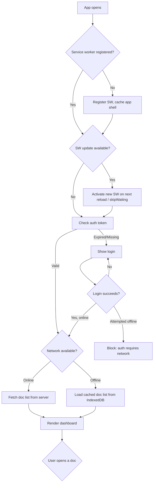
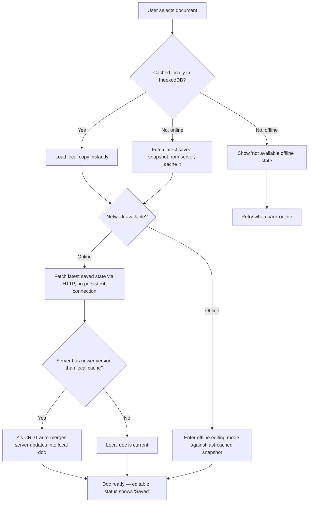
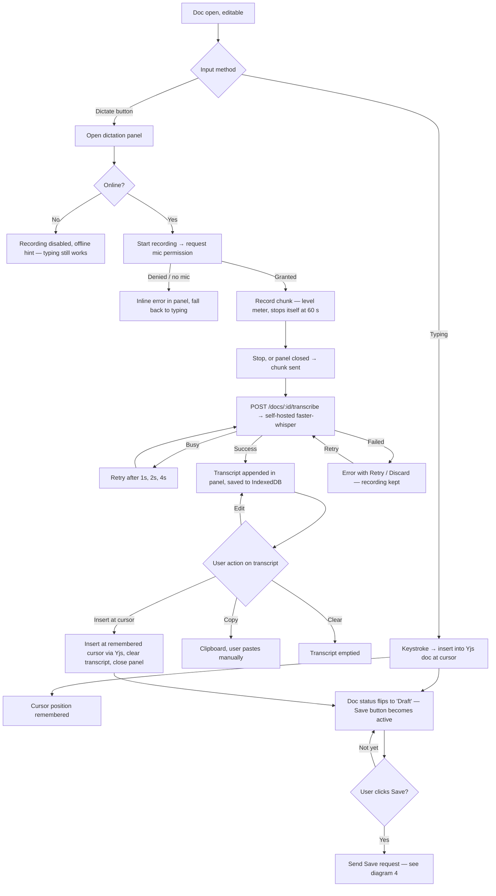
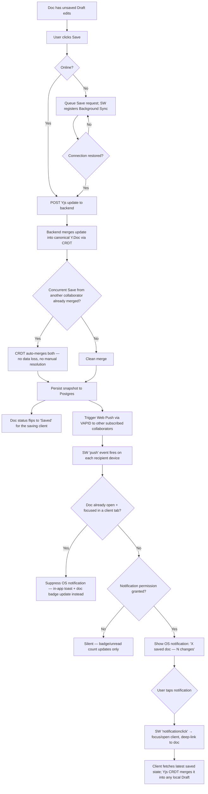
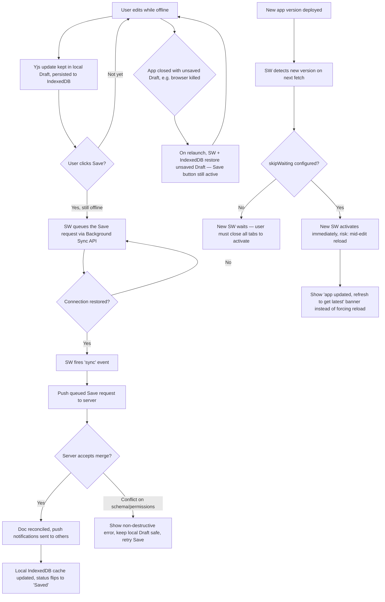

# DocSync — PWA User Flow Diagrams (Mermaid)

Paste any of the code blocks below into https://mermaid.live or any Mermaid-compatible tool.

---

## 1. App launch → auth → document access

---

## 2. Opening a document (online/offline branches)

---

## 3. Editing: typing + dictation panel

Viewers have no Dictate button (master spec §16.1). The offline audio queue is Phase 4.2 and not
built, so offline recording is disabled for now.

---

## 4. Save & push notifications

---

## 5. Offline write, reconnect & service worker edge cases

